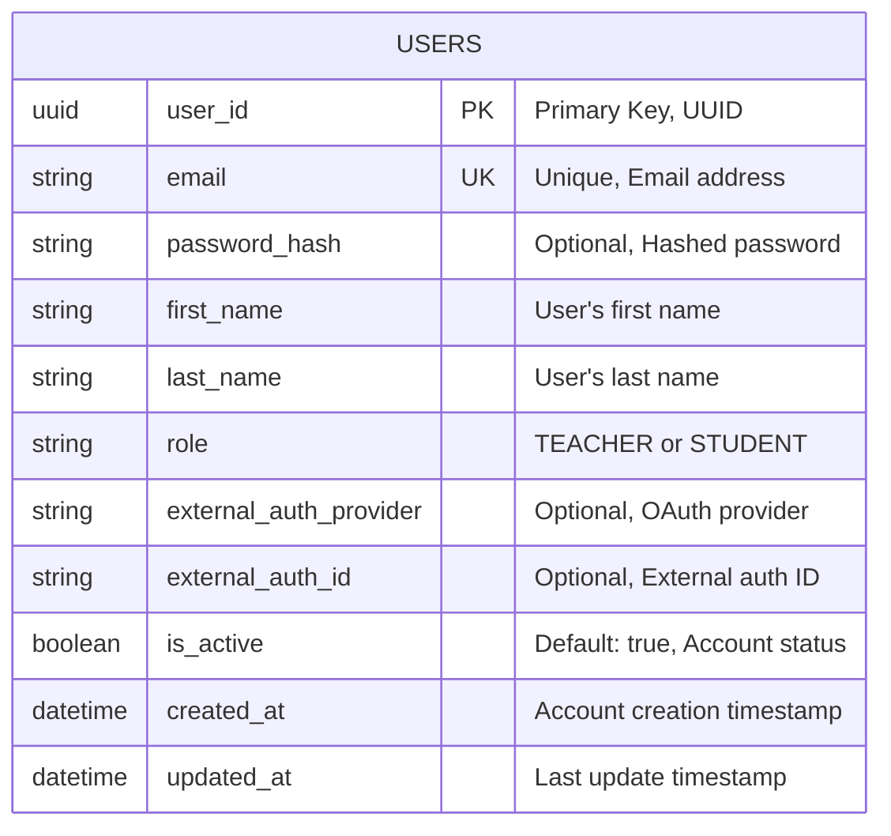

# PAMP Authentication Service

This is the authentication service for the PAMP application. It provides endpoints for user authentication, registration, and token validation.

## Features

- Teacher registration and login
- Student registration (by teachers)
- JWT-based authentication
- Google OAuth integration
- User profile retrieval
- Token debugging

## Database Schema

The authentication service uses a simple database schema with a single entity. Below is the Entity Relationship Diagram (ERD) in Mermaid format:



## API Endpoints

### Authentication

- `POST /login/teacher`: Login for teachers with email and password
- `GET /login/google`: Initiate Google OAuth login
- `GET /login/callback/google`: Google OAuth callback

### User Management

- `POST /register/teacher`: Register a new teacher
- `POST /register/students`: Register multiple students (requires teacher authentication)
- `GET /me`: Get current user information (requires authentication)
- `GET /users`: Get all users (requires authentication)
  - Optional query parameter: `ids` - Comma-separated list of user IDs to filter results
  - Example: `/users?ids=123e4567-e89b-12d3-a456-426614174000,123e4567-e89b-12d3-a456-426614174001`
- `GET /users/{id}`: Get user by ID (requires authentication)
- `GET /users/email/{email}`: Get user by email (requires authentication)

### Utilities

- `POST /debug-token`: Debug a JWT token

## Development

### Prerequisites

- Rust and Cargo
- PostgreSQL database
- Environment variables (see `.env.example`)

### Setup

1. Clone the repository
2. Copy `.env.example` to `.env` and fill in the required variables
3. Run `cargo build` to build the project
4. Run `cargo run` to start the server

### Testing

The project includes comprehensive tests for all endpoints and services. To run the tests:

```bash
cargo test
```

#### Test Coverage

The test suite includes:

- **Unit Tests**: Testing individual components in isolation
- **Integration Tests**: Testing API endpoints with mock authentication
- **Service Tests**: Testing business logic and database operations
- **JWT Tests**: Testing token creation and validation

## API Documentation

API documentation is available at `/swagger-ui` when the server is running.

## Architecture

The service follows a layered architecture:

- **Handlers**: API endpoint handlers
- **Services**: Business logic
- **Entities**: Data models and DTOs
- **Auth**: Authentication and authorization middleware
- **DB**: Database connection and schema management

## License

MIT
